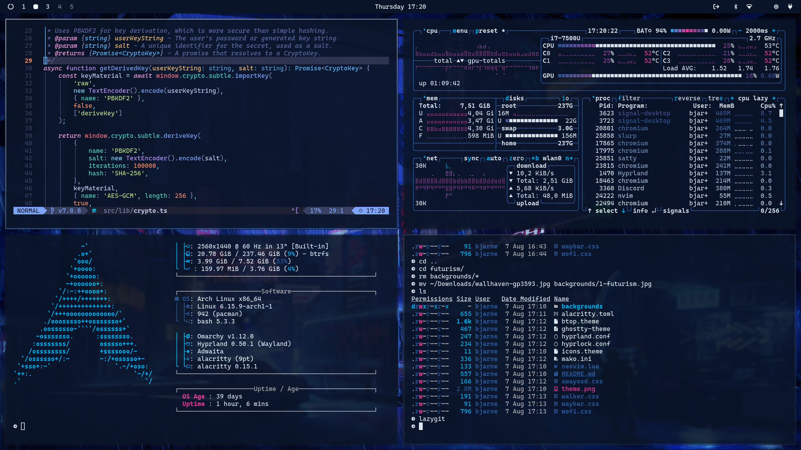

# Omarchy Kubo Theme

This is the Kubo theme for [Omarchy.org](https://omarchy.org), providing a visually appealing configuration set for your Linux desktop environment. The theme features a dark navy and blue color scheme inspired by a panel from the manga, with cyan, purple, and orange accents.

<p align="center">
  
</p>

## Color Palette

The theme uses colors derived from the artwork:
- **Background**: #0d1b2a (Dark navy blue)
- **Foreground**: #e0e1dd (Light gray)
- **Accent Colors**: 
  - Blue: #4ea5d9
  - Cyan: #71c7ec 
  - Purple: #8d5aa6
  - Orange: #f77f00
  - Green: #06a77d

## Background Image

The theme includes a single background image, located in `backgrounds/Earbuds.jpg`.

## Supported Applications

This theme provides configurations for:
- **Desktop Environment**: Hyprland, Waybar
- **Terminal Emulators**: Alacritty, Ghostty
- **Application Launchers**: Wofi, Walker
- **System Tools**: btop, mako, swayosd, hyprlock
- **Text Editor**: Neovim (Tokyo Night Storm theme)

## Installation

To install this theme, simply use the `omarchy-theme-install` command:

```bash
omarchy-theme-install https://github.com/OmyDaGreat/omarchy-kubo-theme
```
